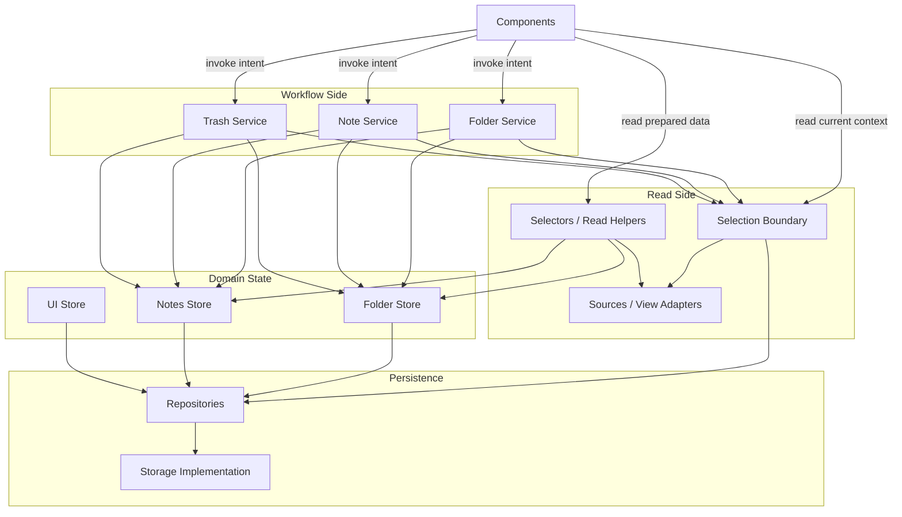

# Svelte UI Layered Architecture

## Purpose

This document describes a layered architecture for Svelte and SvelteKit UI projects.

It applies the same responsibility-driven thinking commonly used in Go services to frontend code:

- keep ownership explicit
- keep layers narrow
- separate workflow orchestration from local state mutation
- separate read-side composition from write-side behavior

The goal is a frontend that is easier to extend, test, and refactor without spreading business rules across UI components.

## Architecture Overview

This architecture uses the following layers:

- components
- selection boundary
- selectors, sources, and read model helpers
- services
- stores
- repositories
- persistence implementation

Each layer has one main reason to change.

- Components render UI and send user intent.
- Selection owns the active UI context.
- Selectors and sources prepare display data.
- Services coordinate business workflows.
- Stores manage reactive local state.
- Repositories isolate persistence-facing operations.
- Persistence implementation handles the database details.

## Architecture Diagram

## Layer Responsibilities

### Components

Components should:

- render state
- collect user input
- call services or UI actions at intent level
- stay as thin as practical

Components may call:

- services
- selectors
- source or view helpers
- UI-only stores

Components should not:

- coordinate multi-entity workflows
- decide delete or restore policy
- perform cross-store orchestration
- embed persistence details

### Selection Boundary

The selection boundary should own:

- the currently selected folder, source, or view context
- persisted selection loading
- stale selection fallback

It may call:

- repositories for persisted selection
- stores to mirror active context if needed during migration

It should not:

- implement business workflows
- decide recovery policy
- delete, restore, or permanently remove entities

### Selectors, Sources, and Read Model Helpers

This layer should own:

- prepared display queries
- view-specific filtering and grouping
- unified read models for folders and virtual views
- capability flags needed by the UI

It may call:

- stores
- selection boundary
- lightweight read-only helpers

It should not:

- mutate state
- persist data
- coordinate workflows

### Services

Services should own:

- business workflows
- cross-store orchestration
- lifecycle rules such as create, delete, recover, and selection transitions

They may call:

- stores
- selection boundary
- repositories when workflow persistence is needed

They should not:

- render display models for components
- hold long-lived reactive UI state
- become generic utility buckets

### Stores

Stores should own:

- domain-local reactive state
- low-level mutations for their own entities
- persistence of their own domain state where appropriate

They may call:

- repositories
- internal low-level helpers in the same domain

They should not:

- orchestrate other stores
- own cross-entity workflows
- decide UI-level business flows

### Repositories

Repositories should own:

- persistence-facing APIs in domain language
- storage wrapping and translation

They may call:

- the low-level storage implementation

They should not:

- own business rules
- hold UI state
- coordinate workflows across domains

### Persistence Implementation

This layer should own:

- concrete database details
- store names, keys, transactions, and low-level storage mechanics

It should not:

- expose business workflows directly to components
- leak persistence detail into services or selectors

## Recommended Project Structure

For a Svelte UI project using this architecture, the default structure should look like this:

- `src/lib/components`
  UI rendering and interaction components
- `src/lib/stores/*.svelte.ts`
  Reactive domain state holders
- `src/lib/stores/services.ts`
  Workflow orchestration
- `src/lib/stores/selectors.ts`
  Read-side composition
- `src/lib/stores/selection.svelte.ts`
  Selected context ownership
- `src/lib/stores/repositories.ts`
  Persistence-facing wrappers
- `src/lib/stores/idbr.ts` or equivalent
  Low-level storage implementation

For larger systems, split by domain when files become crowded:

- `folder.service.ts`
- `note.service.ts`
- `trash.service.ts`
- `folder.selectors.ts`
- `note.selectors.ts`

Use splitting to clarify ownership, not just to increase file count.

## Data Flow

### Write-Side Flow

The default write path should be:

1. component captures user intent
2. component calls a service
3. service coordinates workflow across domains
4. stores perform low-level mutations
5. repositories persist when needed

Example:

- a folder delete action starts in a component
- the component calls `folderService.delete(...)`
- the service coordinates folder state, note state, and selection changes
- stores apply local mutations
- persistence flows through repositories

### Read-Side Flow

The default read path should be:

1. component asks for prepared display data
2. selectors or sources read store state
3. selectors return UI-ready data

Selectors and sources should remain read-only.

If the UI needs grouped, filtered, or view-specific data, prefer selectors or source adapters instead of pushing that logic into components.

## Naming and Conventions

Use these naming conventions by default:

- use `Service`, not `UseCase`
- use domain-oriented names such as `folderService`, `noteService`, `trashService`
- use `store` only for reactive state owners
- use `repository` only for persistence wrappers
- use `selection` for active context ownership
- use `selector` or `source` for read-only composition

Additional rules:

- prefer intent-level method names such as `delete`, `recover`, `create`, `rename`, `empty`
- keep source or view abstractions read-only
- keep component naming UI-focused, not workflow-focused
- prefer domain language over technical utility naming

## Testing Guidelines

Testing should follow the same ownership boundaries as the architecture.

### Store Tests

Store tests should verify:

- local state mutation
- persistence behavior
- low-level domain helpers

### Service Tests

Service tests should verify:

- workflow rules
- orchestration across stores
- selection transitions after create, delete, and recover

### Selector Tests

Selector tests should verify:

- filtering
- grouping
- view composition
- selected state calculations

### Playwright Tests

Playwright tests should verify:

- core user journeys
- selection behavior visible to users
- create, delete, and recover flows

For repeated UI structures such as dialogs, panes, and sidebar trees, prefer scoped helpers instead of broad page-global locators.

## Anti-Patterns

Avoid these patterns:

- components coordinating folder, note, and trash workflows directly
- stores calling other stores to run business processes
- services becoming read-model builders for rendering
- repositories owning business rules
- persistence details leaking into components
- special-case strings spreading across the UI
- multiple owners for persisted selection state
- mixing read-side composition and write-side orchestration in the same layer

## Adoption Checklist

When starting a new Svelte project with this architecture:

1. define the main domains
2. create one store per domain
3. create services for business workflows
4. introduce selection ownership early
5. add selectors when read logic starts growing
6. isolate persistence behind repositories
7. add service tests first
8. add e2e tests for critical user journeys

## Practical Notes

This repo is one example of the architecture in progress:

- thin UI components such as folder and note panes
- workflow services for folder, note, and trash actions
- selectors for read-side composition
- a dedicated selection boundary

The exact file layout can evolve, but the ownership rules should remain stable.
