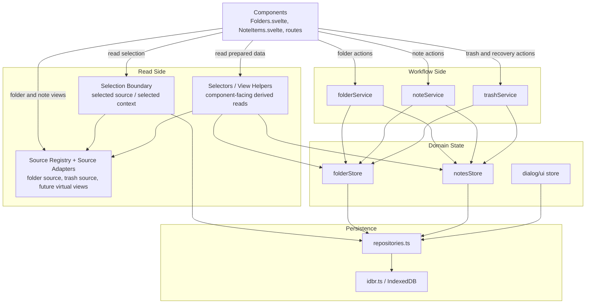

# Frontend Refactor Tracker

## Goal

Refactor the frontend state layer so responsibilities are clearer and closer to SOLID principles.

The intended direction is:

- components should render UI and send user intent
- services should coordinate business workflows
- stores should manage local reactive state and persistence for their own domain
- repositories should isolate IndexedDB access behind persistence-facing APIs
- cross-domain workflows should not live inside individual stores

This document is meant to help future sessions continue the refactor without needing prior chat context.

## Finalized Architecture

This is the intended end-state architecture for the frontend.

Some parts are already in place today, especially the service and repository boundaries.
Some read-side pieces are still planned, mainly the dedicated selection boundary and the unified sidebar source model.

### Layer Responsibilities

- components stay thin and only render state plus send user intent
- a dedicated selection boundary owns which sidebar source is currently active
- source adapters and selectors prepare read-side data for folders, trash, and future virtual views
- services own cross-entity workflows and selection rules after user actions
- stores own local reactive state plus low-level mutations for their own entities
- repositories own persistence-facing APIs
- `idbr.ts` remains the IndexedDB implementation detail behind repositories

### Finalized Diagram

## Target Design

### Components

Components should stay thin.

They should:

- read display state
- trigger intent-level actions
- avoid coordinating note-folder-trash workflows directly

They should not:

- decide recovery strategy
- coordinate permanent deletion
- coordinate cascaded folder-note operations

### Services

Services are the workflow layer.

Current service grouping:

- `folderService`
- `noteService`
- `trashService`

Expected responsibilities:

- `folderService`: folder workflows
- `noteService`: note workflows
- `trashService`: recovery, trash, and permanent deletion workflows

Services should coordinate multiple stores when needed.

Additional finalized guidance:

- services remain the write-side orchestration layer
- selection rules after create, delete, recover, and folder-open events belong here or in the dedicated selection boundary, not in components
- services should not become read-model builders for sidebar rendering

### Repositories

Repositories are the persistence boundary.

They should:

- wrap IndexedDB operations
- expose storage operations in domain language
- keep storage details out of stores and services

They should not:

- own business workflows
- hold UI state
- coordinate cross-domain behavior

### Stores

Stores should be narrower.

They should mostly handle:

- local state
- local persistence
- simple mutations on their own entities
- reusable low-level helpers needed by services

They should avoid:

- calling other stores to orchestrate workflows
- owning multi-entity business processes
- mixing UI workflow decisions with persistence-heavy operations

### Selection Boundary

Selection should be treated as its own concern.

It should own:

- the currently selected sidebar source
- fallback behavior when a stored selection becomes stale
- persistence of selected source or selected context

It should not own:

- folder deletion rules
- note recovery logic
- permanent delete workflows

### Source And Selector Read Model

Folders and virtual views should be modeled through a shared read-side shape.

Examples:

- folder source
- trash source
- future pinned notes source
- future favorites or tags source

This layer should:

- let the sidebar treat folders and virtual views uniformly
- expose capabilities needed by the UI such as create, rename, delete, restore visibility
- keep special-case strings and branching out of components as much as possible

This layer should stay read-only.

## Current Progress

### Completed

1. Domain-oriented services were introduced in `frontend/src/lib/stores/services.ts`.
2. Components now call services instead of directly coordinating the main note/folder/trash flows.
3. Trash orchestration was moved into `trashService`.
4. Folder soft-delete orchestration was moved into `folderService.delete(...)`.
5. Note lifecycle actions used by the UI now go through `noteService` for create, update, select, and soft-delete.
6. Folder UI actions now go through `folderService` for create, select, rename flow, toggle, and soft-delete.
7. `notesStore.createNote(...)` was reduced to a lower-level creation primitive without folder fallback logic.
8. Folder-aware note query rules were moved out of `notesStore` and into `noteService`.
9. `notesStore` no longer depends on `folderStore` for folder-aware queries.
10. Stores were reduced to lower-level helpers for restore, subtree collection, local removal, and selection cleanup.
11. Service-level tests now cover key note queries, folder actions, trash recovery, and permanent delete behavior.
12. Tests were updated to follow service ownership more closely.
13. IndexedDB access was moved behind `frontend/src/lib/stores/repositories.ts`.
14. Folder and note stores now load and save through repositories instead of importing `idbr` directly.
15. `trashService` now depends on `trashRepository` for permanent deletion persistence.
16. UI-facing folder tree reads now start moving through `folderService` instead of directly calling folder-tree helpers on the store.
17. A first Playwright end-to-end folder smoke test was added to validate basic sidebar folder behavior.
18. Service and store tests were adjusted to follow the newer service-owned folder-tree behavior during the migration.
19. Playwright coverage now includes core user flows for folder creation, note creation, note delete/recover, and folder delete/recover.
20. Duplicate folder-tree helpers were removed from `folders.svelte.ts`, and the affected tests now follow the service-owned path.
21. Overlapping folder-tree logic inside `folderService`, `noteService`, and `trashService` was consolidated behind a shared internal service-layer helper.
22. A lightweight selector layer was introduced for note-list and folder-sidebar read composition, and components now use those selectors for key display queries.
23. Selector coverage was expanded so note list actions, selected-state checks, folder sidebar root items, folder badge counts, and child visibility are now prepared outside the components.
24. Selection lifecycle rules are now being owned more explicitly in services for folder selection, note deletion, folder deletion, and note creation.
25. Note restore now also re-selects the restored note and the appropriate folder context.
26. A dedicated `selectionStore` was introduced for sidebar folder selection and persisted selection loading.
27. Services and selectors now read and write sidebar folder selection through the selection boundary instead of treating `folderStore` as the persistence owner.
28. `folderStore` no longer persists selected folder state directly and now acts as a compatibility mirror while the selection refactor continues.
29. Runtime folder creation now receives its parent from the selection boundary, and `selectionStore` no longer mirrors selected folder state back into `folderStore` during normal app flows.
30. The remaining runtime compatibility APIs for folder-owned selection were removed from `folderStore`, and service/selector tests now pass explicit selection dependencies instead of relying on folder-store selection adapters.
31. A shared sidebar source model now prepares both folder and trash entries through the selector layer, including nested children, selection state, edit state, note counts, and UI capabilities, so `Folders.svelte` no longer branches on raw folder-vs-trash details as heavily.
32. The sidebar source model is now registry-driven at the section level, so “views” like trash and regular folder groups are defined in the selector layer and rendered generically by `Folders.svelte`, which creates a cleaner path for future virtual views.
33. IndexedDB helper typing in `idbr.ts` was tightened so settings reconstruction and transactional delete/archive helpers satisfy `svelte-check`, and the frontend now type-checks cleanly again under Node `v24.14.1`.
34. Notes and folders now support an `isFavorite` flag, favorite toggles flow through services, and a `Favorites` virtual view is registered in the sidebar so favorite notes and favorite folders can be surfaced without adding component-specific branching.
35. Playwright e2e configuration now uses `127.0.0.1` consistently for both `baseURL` and the preview server host, which resolves the suite-wide timeout issue caused by the previous localhost/interface mismatch.
36. Favorites behavior is now locked in with tests so deleted favorites disappear immediately from the `Favorites` virtual view, and restoring notes or folders preserves their favorite status.

### In Progress

1. Complete the selection-boundary migration by removing the remaining test-only assumptions and any leftover read models that still treat folder selection as folder-store-owned state.
2. Extend the registry-driven source model with additional virtual views or adapters beyond `Favorites` and trash so future sidebar sources can plug in without requiring selector rewrites.
3. Expand the selector layer only where it meaningfully reduces component coupling or repeated read logic.
4. Test expectations are being aligned incrementally as folder-tree behavior moves from stores to services.

### Verification Notes

- Store and selector/service unit coverage passes under Node `v24.14.1`.
- `npm run check` passes under Node `v24.14.1`.
- Favorites unit coverage passes under Node `v24.14.1`.
- Playwright `folders.e2e.ts` passes under Node `v24.14.1` when served via `127.0.0.1:4173`.

### Deferred

1. Repository maturity can be improved later by moving more persistence semantics out of `idbr.ts` and into repositories.

## What To Do Next

### Step 1

Introduce a dedicated selection boundary for the sidebar and note context.

Goal:

- selection becomes a first-class concern
- stale selected ids can resolve safely
- components stop deciding selection fallback behavior

Notes:

- keep write-side workflow rules in services
- keep this boundary focused on selected source or selected context only
- avoid moving delete or recovery workflows into it

Current status:

- sidebar folder selection boundary is now introduced
- services and selectors are already routed through it
- the remaining work is cleanup of compatibility mirrors and fuller source-based selection

### Step 2

Introduce a unified source model for sidebar items.

Goal:

- folders and virtual views can be rendered through one read contract
- trash stops being a special-case sidebar branch
- future pinned, favorites, or tag views have a clear extension point

Notes:

- keep sources read-only
- selectors may build on top of sources
- services should still own mutations

### Step 3

Split the sidebar component into smaller focused components once the source model exists.

Goal:

- reduce branching inside `Folders.svelte`
- separate folder node rendering from virtual view rendering
- make sidebar behavior easier to test and extend

## How To Continue

Use these guidelines in future sessions:

1. Prefer moving business workflows into services, not into components.
2. Prefer extracting smaller store primitives rather than copying logic into services.
3. Keep stores useful as domain state holders, but not as workflow coordinators.
4. When moving logic, update tests to follow the new ownership model.
5. Avoid implementation churn unless it helps make responsibility boundaries clearer.
6. Prefer keeping folder-aware or trash-aware note rules in `noteService` or `trashService`, not in `notesStore`.
7. Prefer keeping UI-facing folder actions in `folderService`, even if stores still expose lower-level primitives.
8. Prefer moving cross-domain queries into services/selectors rather than embedding them in stores.
9. Prefer service tests for business rules and store tests for local state mutations.
10. Prefer modeling sidebar items as read-side sources rather than growing special-case folder types and string checks.
11. Prefer keeping selection as an explicit boundary instead of spreading it across multiple entity stores.

## Success Criteria

This refactor is in a good state when:

- components mostly call service methods
- selection has a clear owner
- folders and virtual views share a stable sidebar read model
- services own cross-domain workflows
- stores mostly manage their own local state and persistence
- tests read naturally by service/domain responsibility
- adding a new trash or recovery rule does not require editing multiple UI components and multiple stores

## Known Constraint

Local test execution currently has an environment issue with the frontend Vitest setup and Node runtime compatibility.

That is separate from the refactor itself, but future sessions should keep in mind that local verification may still be limited until that environment issue is resolved.

Playwright was added as a lightweight UI validation path, so critical user flows can now be covered end-to-end even while unit-test refactors are still in progress.
